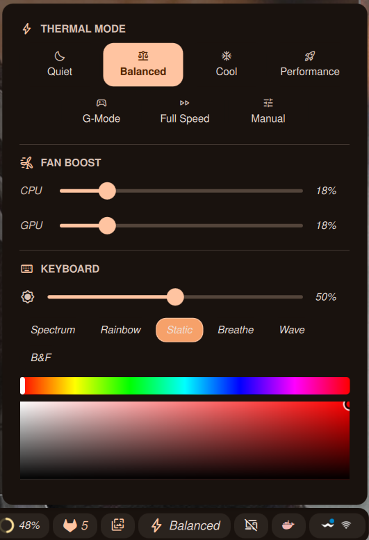

# Alienware Command Center Plugin for DMS

A plugin to control your Alienware laptop's thermal modes, fan boost, keyboard lighting, light bar, and CPU turbo boost via the `awcc` CLI.



## Features

- **Thermal mode selection**: Quiet, Battery Saving, Balanced, Cool, Performance, G-Mode, Full Speed, Manual
- **Fan boost control**: Independent CPU and GPU sliders (1–100%)
- **Keyboard lighting**: Brightness slider, multiple effects (Spectrum, Rainbow, Static, Breathe, Wave, B&F, Default Blue), with an inline color picker for color-based effects
- **Light bar control**: Brightness slider, effects (Rainbow, Spectrum, Breathe, Default Blue), with color picker for Breathe
- **CPU Turbo Boost**: Toggle on/off
- **Auto-refresh**: Polls current thermal mode at a configurable interval

## Requirements

The [`awcc`](https://github.com/tr1xem/AWCC) CLI must be installed and accessible. By default the plugin calls `awcc` from `$PATH`, but you can configure a custom binary path in settings.

## Installation

```bash
mkdir -p ~/.config/DankMaterialShell/plugins/
git clone <repo-url> awcc
```

## Usage

1. Open DMS Settings <kbd>Super + ,</kbd>
2. Go to the **Plugins** tab
3. Enable the **Alienware Command Center** plugin
4. Configure settings if needed (binary path, refresh interval)
5. Add the `awcc` widget to your DankBar configuration

## Configuration

### Settings

- **AWCC Binary Path**: Path to the `awcc` executable (default: `awcc`)
- **Refresh Interval**: How often to poll the current thermal mode in seconds (default: 10, range: 1–60)

### Widget Display

- **Bar pill**: Bolt icon + current thermal mode name
- **Popup**: Full control panel with thermal modes, fan boost sliders, keyboard lighting, light bar, and turbo toggle

## Files

- `plugin.json` — Plugin manifest and metadata
- `AwccWidget.qml` — Main widget component
- `AwccSettings.qml` — Settings interface
- `README.md` — This file

## Permissions

This plugin requires:

- `settings_read` — To read plugin configurations
- `settings_write` — To save plugin configurations
- `process` — To execute the `awcc` CLI commands
