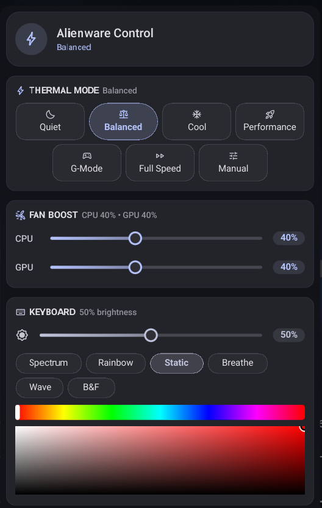

# Alienware Command Center Plugin for DMS

A plugin to control your Alienware laptop's thermal modes, fan boost, keyboard lighting and CPU turbo boost via the `awcc` CLI.



## Features

- **Thermal mode selection**: Quiet, Battery Saving, Balanced, Cool, Performance, G-Mode, Full Speed, Manual
- **Fan boost control**: Independent CPU and GPU sliders (1–100%)
- **Keyboard lighting**: Brightness slider, multiple effects (Spectrum, Rainbow, Static, Breathe, Wave, B&F), with an inline color picker for color-based effects
- **CPU Turbo Boost**: Toggle on/off
- **Adapts to your hardware**: the plugin reads `awcc device-info` on start and
  only shows the sections, thermal modes and lighting effects your machine
  reports. A laptop that does not advertise CPU Turbo, for instance, gets no
  Turbo section at all
- **Confirmation toast** on the changes that reach the hardware — thermal mode,
  keyboard effect and turbo. Sliders are excluded, since dragging one would fire
  a stream of them
- **Auto-refresh**: Polls current thermal mode at a configurable interval

## Requirements

The [`awcc`](https://github.com/tr1xem/AWCC) CLI must be installed and accessible. By default the plugin calls `awcc` from `$PATH`, but you can configure a custom binary path in settings.

## Installation

```bash
mkdir -p ~/.config/DankMaterialShell/plugins/
git clone <repo-url> awcc
```

## Usage

1. Open DMS Settings <kbd>Super + ,</kbd>
2. Go to the **Plugins** tab
3. Enable the **Alienware Command Center** plugin
4. Configure settings if needed (binary path, refresh interval)
5. Add the `awcc` widget to your DankBar configuration

## Configuration

### Settings

- **AWCC Binary Path**: Path to the `awcc` executable (default: `awcc`)
- **Refresh Interval**: How often to poll the current thermal mode in seconds (default: 10, range: 1–60)

### Widget Display

- **Bar pill**: Bolt icon + current thermal mode name. On a vertical bar only the
  icon is drawn, since the bar is too narrow for the mode name.
- **Popup**: a header card with the active mode and turbo state, then one card
  per section — thermal modes, fan boost sliders, keyboard lighting with its
  colour picker, and the turbo toggle. Each card's subtitle carries its current
  value. Sections your hardware does not report are omitted.

## Files

- `plugin.json` — Plugin manifest and metadata
- `AwccWidget.qml` — Main widget component
- `AwccSettings.qml` — Settings interface
- `README.md` — This file

## Permissions

This plugin requires:

- `settings_read` — To read plugin configurations
- `settings_write` — To save plugin configurations
- `process` — To execute the `awcc` CLI commands

## How it works

On start the plugin runs `awcc device-info` and reads the enabled features,
thermal modes and lighting modes, which is what decides the sections and options
shown. It then polls `awcc qm` on the configured interval to keep the active
thermal mode in sync, and issues `awcc <command>` for each control you touch.

Slider drags are debounced, so dragging from 40 to 70 sends a single command on
release rather than one per value.
